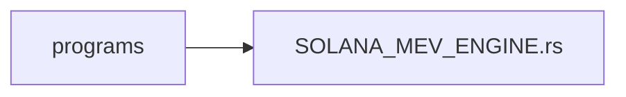
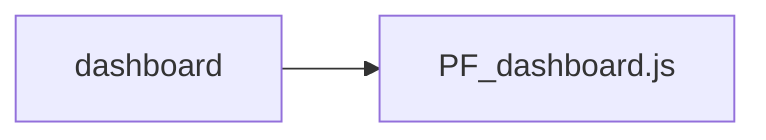
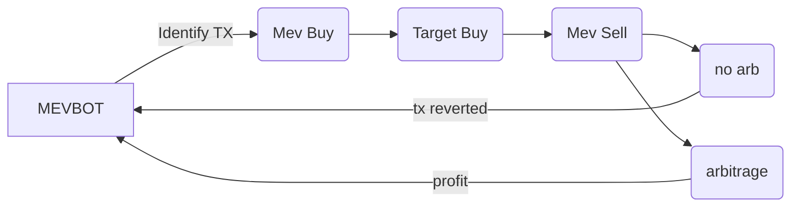

  
# Solana-Mevbot
fully-automatic on-chain pump.fun solana MEVbot leveraging flashloans and the minimal gas fees of Solana to perform sandwich attacks and front-runs on https://pump.fun. 

> [!IMPORTANT]
> Due to the atomic nature of Flashloan operations, if they aren't profitable the transaction will revert and no net profit will be lost.

# Components

-- onchain solana program

-- website dashboard

# Operation

- The bot is constantly sniffing the https://pump.fun Solana master SPL for user buys, sells, and token creations containing slippage deficits.
> [!TIP]
> Bot operators can target any transaction value within their balance threshold. Generally, higher thresholds net consistently viable transactions
-  Once a transaction is identified, a flashloan is initiated for the target transaction amount, this requires a marginal amount of collateral.
-  The bot will aggresively attempt to front-run the transaction by dynamically monitoring the bribe to the miner and increasing it if necessary so as to be the first transaction mined.
- Depending on the set parameters, the bot will either front-run the Dev's sell to remain in profit, or sell upon the token reaching KOTH.
- The flashloan is then repaid, collateral is reiumbursed and profits are deposited into the operators wallet.
-  If the transaction is unprofitable at any point it will be reverted and the flashloan will be repaid, losing no gas or net profit.

# Setup
1. Download or clone the main branch of this repository

2. Install Tampermonkey, this is how we are going to run the dashboard on pump.fun

3. Launch the program on Solana and paste your MEVbot SPL address into the `program_address` variable.
> [!IMPORTANT]
>  skip this step if you want your dashboard to connect to my public MEV program for a .1% trading fee! 
4. Visit https://pump.fun

5. Open the Tampermonkey extension

6. Click `+ create new script`

7. Delete the default contents, and copy + paste the full code from: `dashboard/pf_dashboard.js`

8. Save the file. The dashboard has now been installed.

9. Visit https://pump.fun and refresh the page. The dashboard should now be visible

10. Fund your operator's wallet. Recommended amount is 1.5 - 2 SOL for proper token acquisition and smooth operation. 

11. Click "START"

12. Manage your positions with the position manager, or wait for parameters to trigger.

13. Click STOP to stop the bot and close all positions at any time

> [!IMPORTANT]
> The bot will immediately begin searching for and transacting arbitrage on https://pump.fun

> [!TIP]
> Stop the bot any time by clicking the "STOP" button. any current transactions will be sold or reverted.

# Tips

- Make sure tampermonkey isn't in developer mode otherwise the dashboard wont run. Additionally this keeps your browser environment safe.

- Increase the flashloan limit by .5 - 1 SOL if you wish to target more than one or two coins at a time.

# Contributions

Code contributions are welcome. If you would like to contribute please submit a pull request with your suggested changes.

# Support
If you benefitted from the project, show us some support by giving us a star ⭐. Open source is awesome!

# Help
If at any time you encounter any issues with the contract setup, contact the team at https://t.me/solana_mevbot 🛡️